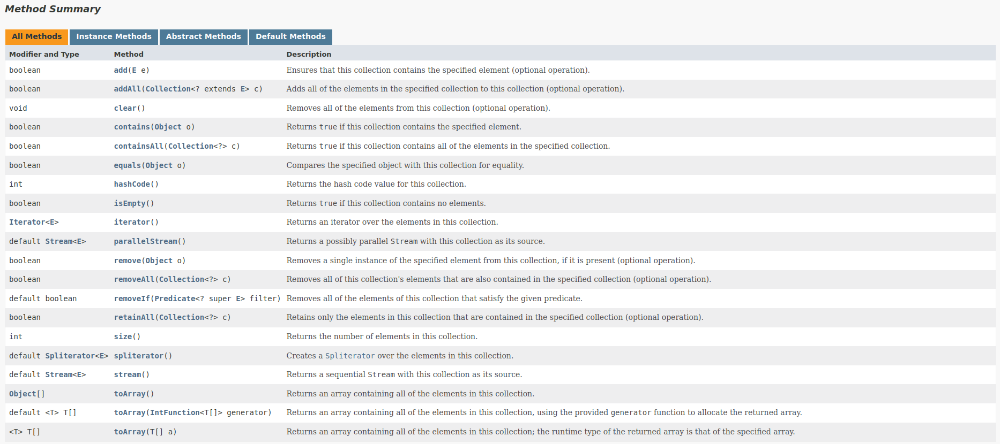

# Collection Framework API

<h3> Java collections challenges from Santander's full stack Java-Angular bootcamp!!! </h3>

- A collection is a data structure that serves to group many elements into a single unit, these elements must be Objects.
- A Collection can have homogeneous and heterogeneous collections, we normally use homogeneous collections of a specific type.
- The main core of the collections is formed by the interfaces in figure below. These interfaces allow you to manipulate the collection regardless of the level of detail they represent.
- We have four major types of collections: `List` (list), `Set` (set), `Queue` (queue) and `Map` (map), from these interfaces, we have many concrete subclasses that implement several different forms to work with each collection.

<p align="center">
<br>
<a href="https://data-flair.training/blogs/collection-framework-in-java/">Hierarchy of Collection Framework in Java </a>
</p>

- All interfaces and classes are found within the `java.util` package.
- Although the `Map` interface is not a direct child of the `Collection` interface, it is also considered a collection due to its function.

<p align="center">
<br>
<a href="https://docs.oracle.com/en/java/javase/17/docs/api/java.base/java/util/Collection.html">Method Summary Collection Interface</a>
</p>

---
### References:

[1] "Java Collections - Java University." Java University. Available at: http://www.universidadejava.com.br/java/java-collection/.

[2] "Java™ Platform, Standard Edition 17 API Specification - Interface Collection." Oracle. Available in: https://docs.oracle.com/en/java/javase/17/docs/api/java.base/java/util/Collection.html.

[3] "Java Comparator and Comparable - Baeldung." Baeldung. Available at: https://www.baeldung.com/java-comparator-comparable.

[4] "Java™ Platform, Standard Edition 17 API Specification - Class Collections." Oracle. Available at: https://docs.oracle.com/en/java/javase/17/docs/api/java.base/java/util/Collections.html.

---

If you prefer to use the SSH protocol to communicate with the repository, follow the steps below:

If you prefer to use the SSH protocol to communicate with the repository, follow the steps below:

1. Open the terminal or command prompt.

2. Navigate to the project directory.

3. Run the following command to change the remote URL to SSH:

```shell
   git remote set-url origin git@github.
   com:daniellimadev/collections-java-api-2023.git
